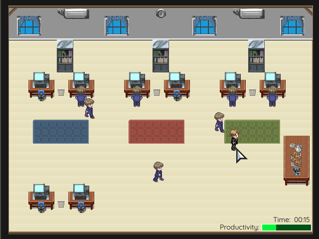

# GAMES-2019-T1 | Go To Work!

Available to play [>> HERE <<](https://jonnrauber.github.io/digital-games/)

Author: Jonathan Terhorst Rauber \
Reg. number (aka "nº de matrícula"): 1421101008

## Summary

After hours of development, software programmers become unproductive. It is very common for them to get up from their chairs, and heading toward the coffee machine in the right side of the room to have a chat; another practice, a little more discreet, is to minimize the IDE and lose time browsing the Internet in search of memes.
It is obvious that you, the boss, can not accept this kind of behavior, since you must maintain ~your high standard of living~ the environment productive. Make those guys work!

### _Resumo_
_De tempos em tempos, os programadores de uma agência de software tornam-se improdutivos. É comum levantarem-se de suas cadeiras, indo em direção a cafeteira presente na sala para jogar conversa fora; outra prática, um pouco mais discreta, é a de minimizar a IDE e se perder navegando pela Internet em busca de memes. \
É óbvio que você, o chefe, não pode aceitar esse tipo de conduta, pois precisa manter ~seu alto padrão de vida~ o ambiente produtivo. Faça esses caras trabalhar!_

## Game Screenshots

There are three commands in game: spacebar key press & LEFT/RIGHT mouse click events.\
_Há três comandos no jogo: a tecla "barra de espaço" e cliques com os botões esquerdo e direito do mouse._

When programmers are going to coffee table, you need to go towards them and press the spacebar to send them back.\
_Quando os programadores dirigem-se à mesa do café, você precisa ir até eles e pressionar a barra de espaço para mandá-los de volta aos seus postos._

When programmers are still in their computers but staying away from work, you need to throw a warning sheet (containing some work to do).\
_Quando os programadores ficam em seus computadores mas "viajam" e perdem-se do rumo do trabalho, você precisa literalmente jogar uma notificação para eles, contendo também algum trabalho para fazer._

